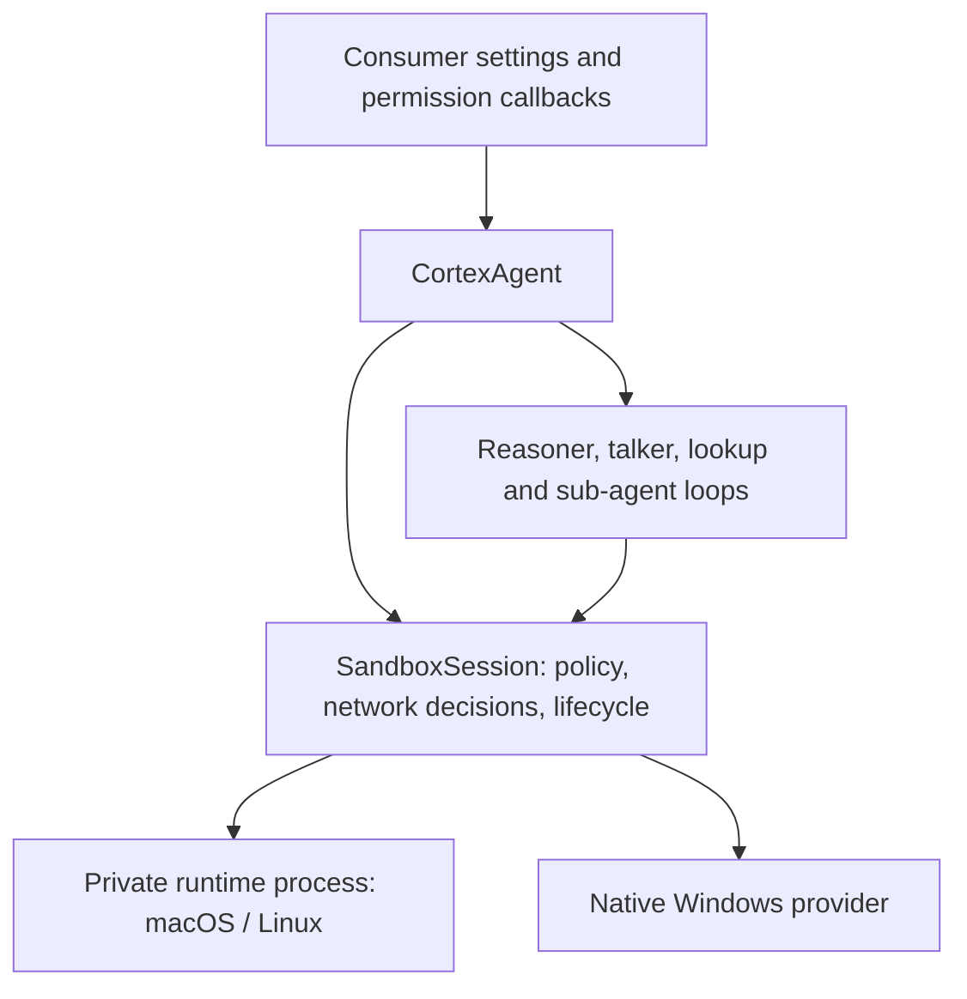

# Sandboxing

Cortex owns sandboxing as an opt-in framework capability. All policy and platform implementation code ships in `@animus-labs/cortex`. Consumers choose whether to enable it and supply settings; they do not construct a backend for ordinary use. See the [consumer guide](./sandbox-consumer-guide.md) for configuration.

## Ownership

`CortexAgent.create()` resolves sandbox settings before creating its loops. A managed session creates the default policy and private temporary directory, initializes the platform backend, and checks enforcement. All resident loops, sub-agents, and framework-owned stdio MCP processes borrow that same session. Loops never dispose it. The facade shuts down its loops and owned MCP connections before disposing the sandbox and removing the temporary directory. Failed creation also cleans up.

The framework defaults to sandboxing disabled. `sandbox: true` enables workspace containment with strict enforcement. An object can select a rung and override settings. No extra setup callbacks are required.

## Why the package boundary changed

The July 2026 design intentionally put enforcement in a separate package to keep Cortex's dependencies small and make the backend replaceable. It placed backend initialization, policy construction, temporary-directory creation, network wiring, and cleanup in consumers.

That separated a framework capability from the framework that needed to own its lifetime. It also made Cortex Code responsible for mandatory in-process file protections that any consumer needs. The revised design keeps replaceable platform modules and the `SandboxProvider` contract inside Cortex, while making the framework own the complete default setup. The runtime dependency is pinned and isolated behind the provider interface. Consumers no longer install a sandbox package.

## Module boundaries

| Module | Responsibility |
| --- | --- |
| `sandbox/options.ts` | Public opt-in settings and validation. |
| `sandbox/session.ts` | Policy, temporary directory, enforcement checks, status, and owned backend lifetime. |
| `sandbox/policy.ts` | Trust presets, protected paths, domain matching, credential names. |
| `sandbox/file-policy.ts` | In-process built-in tool path boundary, including symlink resolution. |
| `sandbox/network-policy.ts` | Shared network policy and session grants. |
| `sandbox/factory.ts` | Platform selection. |
| `sandbox/backends/runtime-process.ts` | Private macOS/Linux worker lifecycle and IPC. |
| `sandbox/backends/runtime-worker.ts` | Worker-side runtime adapter. |
| `sandbox/backends/runtime.ts` | Translation to pinned sandbox-runtime and OS wrapper generation. |
| `sandbox/backends/windows.ts` | Native Windows helper integration and status. |
| `sandbox/classify.ts` | Structured denial diagnostics. |

Platform modules never depend on Cortex Code. The facade has a thin lifecycle integration, and AgentLoop borrows the provider contract. The native helper source and future bundled artifacts live under `packages/cortex/windows-helper` and `packages/cortex/vendor`.

## Policy and approval

Containment limits what an executing command can access. Permission callbacks decide when a human must approve an operation. Approving a built-in file tool does not bypass its sandbox policy. A single-command Bash escalation is separately authorized and does not change the session policy.

| Rung | Filesystem policy | Network policy |
| --- | --- | --- |
| `restricted` | No workspace writes; secret reads denied. | No egress. |
| `workspace` | Write workspace roots and private temp; secrets and dangerous configuration protected. | Seeded registries, configured allowlist, optional host decisions. |
| `trusted` | Same filesystem boundary as workspace. | Open HTTP/S through the proxy, subject to explicit denials. |
| `off` | No sandbox boundary. | No sandbox gate. |

The runtime has narrow OS-required writable exceptions even in restricted mode; it is not a claim that every byte on the filesystem is read-only. Roots come from trusted configuration and cannot widen when a tool changes its working directory. Consumers add their own settings and secrets to the built-in deny lists.

Policy changes belong to trusted host code. `setSandboxRung()` requires settled agent work, rejects concurrent changes, and blocks new tool execution during a transition. Connected stdio MCP servers must be disconnected before a policy change and reconnected afterward so they launch under the new OS profile. Consumers own persistence and the decision to expose policy changes to users.

## Platform enforcement

On macOS and Linux, Cortex uses pinned `@anthropic-ai/sandbox-runtime` 0.0.63. It generates Seatbelt profiles on macOS and bubblewrap/seccomp wrappers on Linux, with a proxy for domain-controlled network access. Linux requires working `bubblewrap` and `socat`; available binaries alone do not prove that user namespaces are usable.

The upstream runtime owns process-global policy, proxy state, and temporary-directory environment. Each managed root agent therefore gets a private worker process. Two agents can use different roots and policies without overwriting each other's runtime state. Disposing one agent leaves the other agent's backend active. The host environment is not modified.

Native Windows uses Cortex's restricted-token helper. Tier 1 confines writes and scrubs credential environment variables, but does not enforce secret-file read denial or network restrictions. It reports filesystem `partial` and network `none`. A missing or unusable helper reports `none`. Signed helper distribution and stronger Windows containment remain separate work; see [the build runbook](./windows-sandbox-build.md).

`SandboxStatus` reports actual enforcement. Managed setup requires all requested dimensions by default and refuses unavailable or partial enforcement. `requireEnforcement: false` explicitly permits degraded operation. Cortex Code chooses that fallback explicitly to retain its existing behavior and displays the result; this is a consumer preference, not a framework default.

## Network flow

Cortex checks explicit denied domains first. Restricted policy denies every host. Workspace policy permits seeded registries and configured domains; unknown hosts reach the optional `resolveNetworkAccess` callback and otherwise are denied. Session grants cover shell traffic and WebFetch. Trusted policy allows network traffic subject to explicit deny rules.

The managed session automatically wires shell requests through the same resolver as WebFetch. In duplex mode this includes the permission broker, so a callback returning `ask` reaches the conversation. A consumer adopting managed setup does not call `getNetworkAccessResolver()` to finish construction.

## Coverage and limits

Bash, Grep, and framework-owned stdio MCP subprocesses use the shared provider. Built-in file tools receive path checks before execution, even without a consumer permission callback. Symlink targets and not-yet-existing paths are resolved through their existing ancestors. These checks supplement the OS boundary; in-process checks are not a filesystem isolation mechanism for the entire Node process.

Custom tools, skill preprocessing, direct consumer subprocesses, remote MCP servers, and host-side network clients do not become contained merely because the agent has a sandbox. Custom tools must honor policy or use an isolated execution path. Glob checks its requested search root; it does not hide every denied descendant name from directory listings. Read denial applies when contents are opened by the built-in Read tool or the OS-contained subprocess.

macOS/Linux network control is proxy-oriented, so arbitrary raw socket protocols are not a general supported egress interface. Loopback access and OS-required paths retain the backend's documented exceptions. Windows Tier 1 has the larger limitations described above.

Tests cover policy, denials, credential scrubbing, managed cleanup and transitions, in-process file gates, platform adapters, and real macOS containment. The two-root integration test proves simultaneous worker isolation and surviving-agent operation after teardown. Native Windows containment tests require a Windows host and helper.
